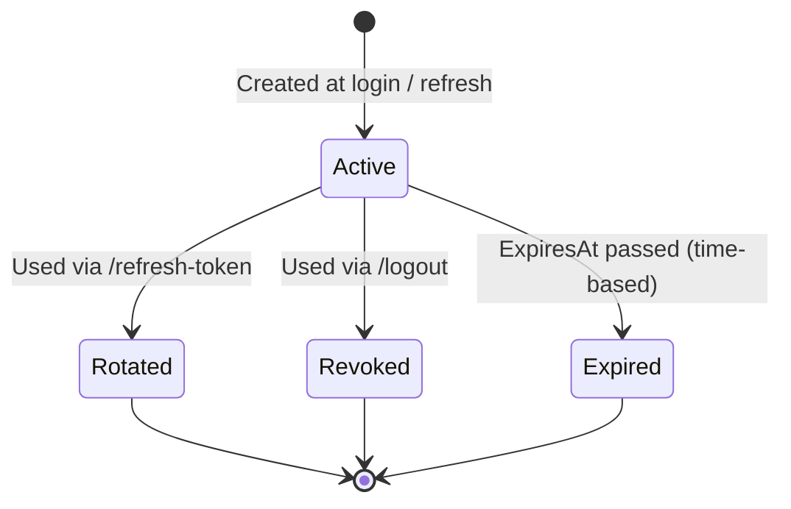

# Refresh Token & Logout Workflow

This document explains, step by step, how JWT access tokens, refresh tokens, and
logout work in `LMSPro.Api`, and which files are involved in each step.

## Why a refresh token?

The access token (JWT) issued on login is short-lived (`Jwt:Lifetime` minutes,
see [appsettings.json](LMSPro/src/LMSPro.Api/appsettings.json)). Once it expires,
the client would normally be forced to log in again with username/password.
A refresh token lets the client silently obtain a new access token without
re-entering credentials, while still allowing the server to revoke access
(logout, stolen token, etc.) at any time.

## Components involved

| Component | File | Responsibility |
|---|---|---|
| `RefreshToken` entity | [Entities/RefreshToken.cs](LMSPro/src/LMSPro.Api/Entities/RefreshToken.cs) | Stores the refresh token value, its owner, expiry and revocation state |
| `RefreshTokenConfiguration` | [FluentApies/RefreshTokenConfiguration.cs](LMSPro/src/LMSPro.Api/FluentApies/RefreshTokenConfiguration.cs) | EF Core mapping (table, unique index on `Token`, FK to `User`) |
| `AppDbContext` | [Data/AppDbContext.cs](LMSPro/src/LMSPro.Api/Data/AppDbContext.cs) | Exposes `DbSet<RefreshToken> RefreshTokens` |
| `ITokenService` / `TokenService` | [Services/TokenService.cs](LMSPro/src/LMSPro.Api/Services/TokenService.cs) | Generates the JWT access token and a cryptographically random refresh token string |
| `IAuthService` / `AuthService` | [Services/AuthService.cs](LMSPro/src/LMSPro.Api/Services/AuthService.cs) | Orchestrates login, refresh, and logout; persists/revokes `RefreshToken` rows |
| `AuthController` | [Controllers/AuthController.cs](LMSPro/src/LMSPro.Api/Controllers/AuthController.cs) | Exposes `POST /api/auth/login`, `POST /api/auth/refresh-token`, `POST /api/auth/logout` |
| `RefreshTokenRequestDto` | [Dtos/RefreshTokenRequestDto.cs](LMSPro/src/LMSPro.Api/Dtos/RefreshTokenRequestDto.cs) | Request body `{ "refreshToken": "..." }` used by both refresh and logout endpoints |
| `LoginResponseDto` | [Dtos/LoginResponseDto.cs](LMSPro/src/LMSPro.Api/Dtos/LoginResponseDto.cs) | Response body `{ accessToken, refreshToken, tokenType, expires }` |
| `JwtSettings` | [Configurations/Settings/JwtSettings.cs](LMSPro/src/LMSPro.Api/Configurations/Settings/JwtSettings.cs) | Adds `RefreshTokenLifetimeDays` next to the existing `Lifetime` (access token minutes) |

## Step-by-step: Login (`POST /api/auth/login`)

1. Client sends `{ userNameOrEmail, password }` to `AuthController.Login`.
2. `AuthService.LoginAsync` finds the user and verifies the password hash (unchanged from before).
3. `AuthService` calls the new private helper `GenerateLoginResponseAsync(user)`, which:
   a. Builds a `UserGetDto` and calls `TokenService.GetToken(...)` to produce the short-lived JWT **access token**, containing the `UserId`, `FirstName`, `LastName`, `UserName`, `Role`, `Email` claims (same as before).
   b. Calls `TokenService.GenerateRefreshToken()`, which produces 64 random bytes via `RandomNumberGenerator` and Base64-encodes them — an opaque, unguessable string (it carries no user data itself).
   c. Creates a new `RefreshToken` row: `Token = <the random string>`, `UserId`, `CreatedAt = UtcNow`, `ExpiresAt = UtcNow + Jwt:RefreshTokenLifetimeDays`. Saves it via `IBaseRepository<RefreshToken>`.
4. The response contains both tokens:
   ```json
   {
     "accessToken": "<JWT>",
     "refreshToken": "<random string>",
     "tokenType": "Bearer",
     "expires": 5
   }
   ```
5. The client stores the access token (used as `Authorization: Bearer <accessToken>` on every request) and keeps the refresh token somewhere safe (e.g. secure storage / httpOnly cookie) to use later.

## Step-by-step: Refreshing an access token (`POST /api/auth/refresh-token`)

1. Once the access token expires (API starts returning 401), the client calls
   `POST /api/auth/refresh-token` with `{ "refreshToken": "<the stored value>" }` — no access token needed for this call.
2. `AuthService.RefreshTokenAsync`:
   a. Looks up the `RefreshToken` row by its `Token` value, including the related `User`.
   b. If it doesn't exist, or `storedToken.IsActive` is `false` (i.e. `IsRevoked` or `IsExpired`, computed from `RevokedAt`/`ExpiresAt`), it throws `UnauthorizedException("Invalid or expired refresh token.")` → HTTP 401 via `ExceptionMiddleware`.
   c. Otherwise it calls the same `GenerateLoginResponseAsync(storedToken.User)` helper used at login — issuing a **brand new** access token **and** a **brand new** refresh token.
   d. **Rotation**: the old refresh token row is marked used — `RevokedAt = UtcNow` and `ReplacedByToken = <new refresh token value>` — then saved. It can never be used again.
3. The client receives a fresh `{ accessToken, refreshToken, ... }` pair and replaces its stored tokens with the new ones.

Why rotate instead of reusing the same refresh token indefinitely? If a refresh
token is ever stolen, rotation limits its usefulness: the moment either the
legitimate client or the attacker uses it, it becomes invalid, so both parties
would notice something is wrong (the other side's next refresh call fails).

## Step-by-step: Logout (`POST /api/auth/logout`)

1. Client calls `POST /api/auth/logout` with `{ "refreshToken": "<the stored value>" }`.
2. `AuthService.LogoutAsync`:
   a. Looks up the `RefreshToken` row by its `Token` value.
   b. If not found, throws `NotFoundException` → HTTP 404.
   c. If found and still active, sets `RevokedAt = UtcNow` and saves — the refresh token can no longer be used to obtain new access tokens.
3. The response is `200 OK` with `{ "message": "Logged out successfully." }`.

Note: logout only revokes the **refresh token**; it does not (and cannot)
invalidate an already-issued access token, since JWTs are stateless and valid
until they expire naturally (at most `Jwt:Lifetime` minutes later). This is a
standard trade-off of stateless JWTs — the short access-token lifetime is what
bounds the exposure window after logout.

## State diagram of a `RefreshToken` row



`IsActive` on the entity is simply `!IsRevoked && !IsExpired`, so "Rotated" and
"Revoked" are both represented by `RevokedAt != null` (rotation additionally
fills in `ReplacedByToken` for audit/debugging purposes).

## Configuration

`RefreshTokenLifetimeDays` was added next to the existing `Lifetime` in both
[appsettings.json](LMSPro/src/LMSPro.Api/appsettings.json) and
[appsettings.Development.json](LMSPro/src/LMSPro.Api/appsettings.Development.json):

```json
"Jwt": {
  "Issuer": "http://LMSPro.uz",
  "Audience": "lms-pro-client",
  "SecurityKey": "...",
  "Lifetime": 5,
  "RefreshTokenLifetimeDays": 7
}
```

## Database migration

A new `RefreshTokens` table is required (columns: `RefreshTokenId`, `Token`
(unique), `CreatedAt`, `ExpiresAt`, `RevokedAt`, `ReplacedByToken`, `UserId`
FK to `Users`, cascade delete).

No migration has been generated as part of this change — run it locally
whenever you're ready to update the database, using whatever EF tooling
you already have set up for this project.
